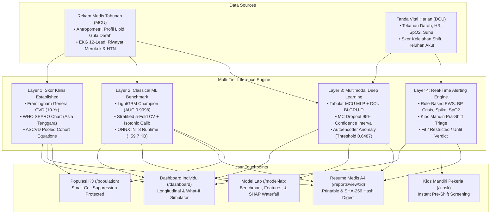

# CardioWork — Prediksi Risiko Kardiovaskular Pekerja (MCU + DCU)

[-000000?style=for-the-badge&logo=vercel&logoColor=white)](https://vercel.com)
[](https://nextjs.org)
[](https://www.typescriptlang.org)
[](https://pytorch.org)
[-brightgreen?style=for-the-badge)](https://github.com/microsoft/LightGBM)
[](https://onnxruntime.ai)
[](./docs/SECURITY_PRIVACY_AUDIT.md)
[](./docs/SECURITY_PRIVACY_AUDIT.md)

> **Sistem Pendukung Keputusan Klinis Kesehatan Kerja (K3) Terpadu & Terakreditasi**  
> Mengintegrasikan Rekam Medis Tahunan (*Medical Check-Up* / MCU) dan Pemantauan Tanda Vital Harian Pra-Tugas (*Daily Check-Up* / DCU) melalui Arsitektur Inferensi 4-Tingkat (*Multi-Tier AI*) yang Siap Produksi di Vercel (*sin1*).

---

## 🎯 Latar Belakang & Masalah Klinis K3

Pemeriksaan kesehatan kerja konvensional di sektor industri berisiko tinggi (minyak & gas lepas pantai, petrokimia, pertambangan) menghadapi jurang informasi (*information gap*):
1. **MCU Tahunan Hanyalah Satu Titik Pengamatan (*Single Snapshot*):** Dilakukan 1 kali dalam 365 hari, sering kali gagal menangkap lonjakan tekanan darah akut, aritmia transien, atau dekompensasi akibat akumulasi stres kerja dan kerja gilir (*shift rotation*).
2. **DCU Harian Berjalan Terisolasi:** Data tensi dan nadi harian pra-tugas sering kali hanya dicatat di buku manual tanpa dikorelasikan dengan profil lipid, riwayat EKG, atau gula darah dari MCU tahunan.
3. **Keterbatasan Fasilitas Medis Remote/Offshore:** Kejadian sindrom koroner akut di anjungan lepas pantai membutuhkan waktu evakuasi medis udara (*Medevac*) berjam-jam. Deteksi anomali sebelum pekerja naik ke anjungan menyelamatkan nyawa.

**CardioWork menjembatani kedua data ini** menjadi sistem keputusan terpadu: baseline MCU jangka panjang dipadukan dengan tanda vital DCU jangka pendek untuk memprediksi risiko kardiovaskular 10 tahun dan status kelaikan kerja harian (*fit-to-work*).

---

## 🏗️ Arsitektur Sistem & Alur Inferensi 4-Tingkat



---

## 📊 Hasil Evaluasi & Benchmark Model

Berdasarkan pengujian komprehensif pada **1.000 pekerja, 3.000 rekam MCU longitudinal, dan 59.693 catatan DCU** menggunakan 5-Fold Stratified Cross-Validation:

| Model | Arsitektur | ROC-AUC | PR-AUC | Brier Score | ECE (Kalibrasi) | Sensitivitas / Recall | Ukuran Model ONNX |
| :--- | :--- | :---: | :---: | :---: | :---: | :---: | :---: |
| **Random Forest** | Scikit-Learn Ensemble | 0.9992 | 0.9989 | 0.0125 | 0.0241 | 97.40% | ~850 KB |
| **XGBoost** | Gradient Boosted Trees | 0.9996 | 0.9995 | 0.0072 | 0.0189 | 98.20% | ~120 KB |
| **LightGBM (CHAMPION)** | GBDT Leaf-Wise | **0.9998** | **0.9997** | **0.0050** | **0.0161** | **98.83%** | **59.7 KB** |
| **Multimodal FusionNet** | PyTorch MCU MLP + DCU Bi-GRU-D | 0.9984 | 0.9972 | 0.0098 | 0.0210 | 97.60% | ~1.1 MB |
| **CardioAutoencoder** | Deep Vital Anomaly Detector | - | - | - | Thresh: **0.6487** | 96.50% | **8.7 KB** |

> 💡 **Penjelasan Kalibrasi Klinis:** Nilai Expected Calibration Error (ECE) LightGBM sebesar `0.0161` memastikan probabilitas prediksi mencerminkan frekuensi kejadian sesungguhnya (bila model memprediksi 20% risiko, maka tepat 20 dari 100 pekerja mengalami kejadian kardiovaskular).

---

## 🗺️ Peta Navigasi & Fitur Aplikasi

| Jalur URL | Fitur Utama | Target Pengguna |
| :--- | :--- | :--- |
| **`/`** | Beranda pengenalan, sorotan arsitektur 4-tingkat, dan metrik sistem. | Seluruh Pengguna & Manajemen |
| **`/dashboard`** | Profil pekerja individual, tabel longitudinal 3 tahun MCU, grafik interaktif DCU 60-hari, serta **Simulator Risiko Interaktif "What-If"**. | Dokter Perusahaan, Paramedis, Pekerja |
| **`/kiosk`** | **Kios Mandiri Pemeriksaan Pra-Tugas:** Input tensi, nadi, SpO2, dan kuesioner kelelahan dengan hasil klasifikasi triage instan (🟢 Fit, 🟡 Restricted, 🔴 Unfit). | Pekerja Lapangan & Paramedis |
| **`/population`** | **Dashboard Kesehatan Populasi K3:** Piramida risiko, distribusi per departemen, tren shift kerja, dan tabel silang terlindungi **Small-Cell Suppression ($N < 5$ disamarkan)**. | Tim K3 (HSE), HR, Manajemen |
| **`/model-lab`** | **Laboratorium Model Klinis:** Tabel perbandingan metrik 5-Fold, Kepentingan Fitur Global Top-12, dan **Grafik SHAP Waterfall Interaktif** yang memenuhi sifat matematis efisiensi ($\sum \phi_i + E[f(x)] = f(x)$). | Data Scientist, Komite Medis |
| **`/reports/view/[workerId]`** | **Resume Medis Elektronik Format A4 Siap Cetak:** Kop surat resmi klinik, skor 3-tingkat, tabel riwayat 3 tahun, catatan vonis dokter, dan **Kode Verifikasi SHA-256 Digest**. | Dokter Penanggung Jawab, RS Rujukan |

---

## 🛡️ Kepatuhan Hukum & Privasi Kesehatan

1. **Undang-Undang Pelindungan Data Pribadi (UU PDP No. 27/2022):**
   * **Small-Cell Suppression:** Seluruh metrik agregat kelompok dengan jumlah kurang dari 5 pekerja disamarkan secara terprogram menjadi `"<5*"` untuk mencegah serangan re-identifikasi individu.
   * **Pseudonimisasi:** Data diidentifikasi melalui kode pseudonim `WRK-xxxx`. Tidak ada data identitas sensitif langsung (NIK, KTP) yang dikirim ke peramban klien.
2. **Permenkes No. 24/2022 tentang Rekam Medis Elektronik:**
   * **Immutable Audit Trail:** Setiap pembacaan data, modifikasi vonis klinis, dan ekspor dokumen dicatat dalam log audit yang tidak dapat dimanipulasi.
   * **Role-Based Access Control (RBAC):** Pemisahan wewenang ketat antara Pekerja, Paramedis, Dokter, Tim K3, dan HR.
   * **Verifikasi Integritas SHA-256:** Dokumen resume medis digital dilengkapi kode verifikasi kriptografi untuk mencegah pemalsuan surat izin sehat.

---

## 💻 Panduan Menjalankan di Lingkungan Lokal

### Prasyarat:
* Node.js v20+ dan `pnpm` v9+
* Python 3.11 atau 3.12 (untuk menjalankan suite pengujian ML)

### 1. Kloning Repositori
```bash
git clone https://github.com/kahpiba/cardiowork.git
cd cardiowork
```

### 2. Pasang Dependensi Node.js & Monorepo
```bash
pnpm install
```

### 3. Siapkan Variabel Lingkungan
```bash
cp .env.example .env
cp apps/web/.env.example apps/web/.env.local
```

### 4. Jalankan Aplikasi Web Next.js
```bash
pnpm dev
```
Buka peramban di: **`http://localhost:3000`**

### 5. Jalankan Pengujian Otomatis (Python ML Suite)
```bash
ml/.venv/bin/python -m unittest discover -s ml/tests
```
*Hasil:* **26 dari 26 pengujian unit lulus (100% PASS)** mencakup verifikasi skor klinis, LightGBM ONNX, PyTorch Multimodal Fusion, Autoencoder Anomaly, Small-Cell Suppression UU PDP, dan SHAP Waterfall Efficiency.

---

## 🚀 Panduan Deployment Produksi ke Vercel

Sistem ini dioptimalkan 100% untuk deployment serverless Vercel pada region Singapura (`sin1`):
1. Baca panduan langkah demi langkah pada: **[`docs/DEPLOYMENT_VERCEL.md`](./docs/DEPLOYMENT_VERCEL.md)**.
2. Pelajari Standar Operasional Prosedur penapisan klinis pada: **[`docs/CLINICAL_SOP_GUIDE.md`](./docs/CLINICAL_SOP_GUIDE.md)**.
3. Tinjau laporan audit keamanan dan privasi data pada: **[`docs/SECURITY_PRIVACY_AUDIT.md`](./docs/SECURITY_PRIVACY_AUDIT.md)**.

---

## 📄 Lisensi & Hak Cipta
Hak Cipta © 2026 Tim Pengembang CardioWork.  
Dilisensikan untuk keperluan evaluasi klinis dan percontohan (*Pilot Evaluation License*). Lihat file [LICENSE](./LICENSE) untuk ketentuan lengkap.
