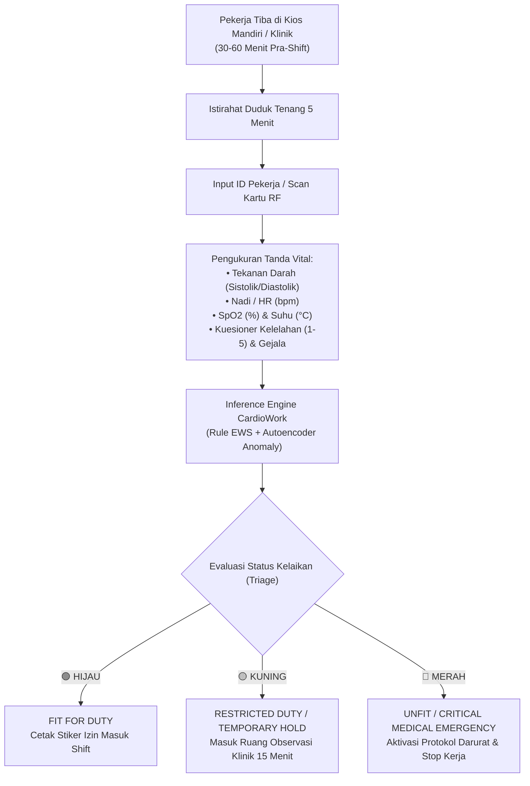

# PANDUAN STANDAR OPERASIONAL PROSEDUR (SOP) KLINIS & K3
## Penapisan Tanda Vital Harian (DCU), Triage Kardiovaskular, dan Protokol Eskalasi Medis Lapangan (Offshore & Remote Sites)

**Dokumen No:** `SOP-K3-MED-042-REV1`  
**Versi:** `1.0.0 (Enterprise Release)`  
**Efektif Sejak:** `28 September 2026`  
**Sasaran:** Paramedis Lapangan (*Offshore Medic*), Perawat K3, Dokter Perusahaan (*Occupational Health Physician* / Dokter Hiperkes), Pengawas Lapangan (*Shift Supervisor*), dan Tim Tanggap Darurat (*Emergency Response Team* / ERT).

---

## 1. TUJUAN & RUANG LINGKUP

### 1.1 Tujuan
1. Memberikan pedoman baku dalam pelaksanaan pemeriksaan kesehatan harian pra-tugas (*Daily Check-Up* / DCU) bagi seluruh pekerja lepas pantai (*offshore rig/platform*), fasilitas kilang (*refinery*), dan area operasi terpencil (*remote sites*).
2. Memanfaatkan sistem pendukung keputusan klinis **CardioWork CDSS** untuk deteksi dini anomali kardiovaskular, krisis hipertensi mendadak, dan kelelahan akut sebelum pekerja terpapar risiko lingkungan kerja ekstrem.
3. Menstandarkan alur penanganan darurat dan eskalasi evakuasi medis (*Medical Evacuation* / Medevac) bagi pekerja dengan status klinis kritis kardiovaskular.

### 1.2 Ruang Lingkup
SOP ini berlaku wajib di seluruh pos medis, klinik platform lepas pantai, klinik kilang, dan stasiun kios mandiri pekerja di lingkungan operasi perusahaan.

---

## 2. DASAR HUKUM & REFERENSI MEDIS

1. **Undang-Undang No. 1 Tahun 1970** tentang Keselamatan Kerja.
2. **Peraturan Menteri Tenaga Kerja dan Transmigrasi No. Per.02/MEN/1980** tentang Pemeriksaan Kesehatan Tenaga Kerja dalam Penyelenggaraan Keselamatan Kerja.
3. **Peraturan Menteri Tenaga Kerja dan Transmigrasi No. Per.03/MEN/1982** tentang Pelayanan Kesehatan Tenaga Kerja.
4. **Peraturan Menteri Kesehatan No. 24 Tahun 2022** tentang Rekam Medis.
5. **Undang-Undang No. 27 Tahun 2022** tentang Pelindungan Data Pribadi (UU PDP).
6. **2019 ACC/AHA Guideline on the Primary Prevention of Cardiovascular Disease**.
7. **2021 European Society of Cardiology (ESC) Guidelines on Cardiovascular Disease Prevention in Clinical Practice**.
8. **WHO HEARTS Technical Package: Cardiovascular Disease Risk Assessment and Management**.

---

## 3. ALUR PEMERIKSAAN HARIAN (DCU) & KIOS MANDIRI

### 3.1 Prosedur Pengukuran Kios Mandiri
1. **Waktu Pelaksanaan:** Dilakukan 30 hingga 60 menit sebelum pergantian gilir kerja (*shift turnover*).
2. **Kondisi Pra-Uji:** Pekerja tidak diperbolehkan merokok, mengonsumsi minuman berkafein/berenergi, atau melakukan aktivitas fisik berat minimal 30 menit sebelum pemeriksaan.
3. **Posisi Pemeriksaan:** Pekerja duduk bersandar tenang dengan kaki menapak di lantai selama minimal 5 menit sebelum penekanan tombol tensimeter. Lengan diletakkan setinggi jantung di atas meja tumpuan.
4. **Instrumen Kios:**
   - Tensimeter digital berstandar klinis (*validasi ESH/AAMI/ISO 81060-2*) dengan manset pneumatik otomatis.
   - Oksimeter denyut digital (*finger pulse oximeter*) terintegrasi sensor fotodioda ganda.
   - Layar sentuh kios dengan antarmuka penapisan gejala mandiri (nyeri dada, pusing berputar, sesak napas).

---

## 4. MATRIKS KLASIFIKASI TRIAGE & PROTOKOL TINDAKAN

| Status Kelaikan | Kriteria Tanda Vital & Sinyal Model | Batasan Kerja / Tindakan Lapangan |
| :--- | :--- | :--- |
| **🟢 FIT FOR DUTY (HIJAU)** | • Tekanan Darah: SBP $< 130$ mmHg dan DBP $< 85$ mmHg • Denyut Nadi: 60 – 100 denyut/menit • Saturasi O2: $\text{SpO}_2 \ge 95\%$ • Suhu: $36.1 - 37.4^\circ\text{C}$ • Skor Kelelahan: 1 – 3 • Anomali Autoencoder: $\text{MSE} \le 0.6487$ • Tanpa keluhan kardiovaskular akut | • **Diberikan Izin Kerja Penuh (Full Clearance)**. • Bekerja sesuai jadwal dan penugasan normal. • Edukasi hidrasi adekuat di area kerja panas (*heat stress protocol*). |
| **🟡 RESTRICTED DUTY (KUNING)** | • Hipertensi Derajat 1–2: SBP 140–179 mmHg atau DBP 90–109 mmHg • Denyut Nadi: 101–120 bpm (takikardia ringan) atau 50–59 bpm • Saturasi O2: $\text{SpO}_2 = 93\% - 94\%$ • Suhu: $37.5 - 38.0^\circ\text{C}$ (subfebris) • Kelelahan: Skor 4 – 5 (kelelahan kerja berat/kurang tidur) • Lonjakan Tekanan Darah: $\Delta \text{SBP} \ge 20$ mmHg dibanding baseline MCU • Rekonstruksi Anomali: $\text{MSE} > 0.6487$ | • **Pekerja Tidak Boleh Langsung Masuk Area Operasi**. • Istirahatkan di ruang klinik ber-AC selama 15 menit, lalu lakukan pengukuran ulang manual oleh paramedis. • Jika tanda vital tetap abnormal: Terbitkan **Surat Pembatasan Kerja (Restricted Duty)** untuk shift berjalan:   - ❌ Dilarang bekerja di ketinggian (*working at height* $>1.8$ m).   - ❌ Dilarang memasuki ruang terbatas (*confined space*).   - ❌ Dilarang mengoperasikan alat berat / crane.   - ❌ Dilarang tugas menyelam (*commercial diving*).   - ✅ Dialihkan ke tugas supervisi ringan atau administrasi kantor kendali (*control room*). • Jadwalkan pemeriksaan ulang dalam 4 jam. |
| **🔴 UNFIT / CRITICAL (MERAH)** | • Krisis Hipertensi: $\text{SBP} \ge 180$ mmHg atau $\text{DBP} \ge 110$ mmHg • Hipoksemia Nyata: $\text{SpO}_2 < 93\%$ pada udara ruangan • Disritmia/Aritmia Berat: Denyut nadi $> 120$ bpm atau $< 50$ bpm ireguler • Gejala Red-Flag Aktif:   - Nyeri dada menjalar ke lengan kiri, leher, atau rahang (*angina pectoris*).   - Sesak napas akut (*acute dyspnea*).   - Keringat dingin profus (*diaphoresis*), sinkop/pingsan, atau mual hebat. | • **KATEGORI DARURAT MEDIS: SEGERA HENTIKAN SELURUH AKTIVITAS PEKERJA**. • Bawa pekerja ke Ruang Tindakan Gawat Darurat Klinik. • Baringkan posisi semi-Fowler $\pm 30-45^\circ$. • Pasang oksigen kanul nasal 3–4 Lpm jika $\text{SpO}_2 < 94\%$. • Pasang monitor jantung dan rekam EKG 12-lead lengkap. • Hubungi Dokter Penanggung Jawab Pelayanan (DPJP) / Chief Medical Officer Onshore. • Aktifkan Protokol Medevac Kategori 1 bila dicurigai Sindrom Koroner Akut (SKA) atau Krisis Hipertensi dengan kerusakan organ target (*end-organ damage*). |

---

## 5. PROTOKOL ESKALASI EVAKUASI MEDIS OFFSHORE (MEDEVAC)

### 5.1 Kategori Prioritas Medevac
* **Prioritas 1 (Urgent / Life-Threatening):** Evakuasi menggunakan helikopter darurat (*dedicated medevac flight*) dalam waktu $< 2$ jam menuju Rumah Sakit Rujukan Tingkat 3 (mis. RS Pertamina Balikpapan / RS Pertamina Pusat Jakarta / RS Siloam terdekat).
  - Indikasi: Suspek *ST-Elevation Myocardial Infarction* (STEMI), Non-STEMI dengan ketidakstabilan hemodinamik, Krisis Hipertensi Ensefalopati/Edema Paru Akut, Henti Jantung Pulih (*Post-Cardiac Arrest*).
* **Prioritas 2 (Priority / Serious Non-Life Threatening):** Evakuasi pada penerbangan helikopter terjadwal pertama atau kapal cepat medis (*crew boat*) dalam waktu $< 6$ jam.
  - Indikasi: Hipertensi refrakter tanpa nyeri dada akut, anomali elektrokardiogram signifikan tanpa kolaps sirkulasi.
* **Prioritas 3 (Routine Transfer):** Pemulangan terjadwal untuk investigasi kardiovaskular lanjutan di darat (*onshore cardiologic evaluation*).

### 5.2 Rantai Komando Aktivasi Medevac
1. **Offshore Medic** melakukan stabilisasi awal, melengkapi Lembar Pengkajian Medis (*Medical Summary Sheet*) dengan mencetak Resume Klinis CardioWork.
2. Paramedis menghubungi **Onshore Chief Medical Officer (CMO)** untuk konsultasi medis jarak jauh (*telemedicine endorsement*).
3. Paramedis memberitahukan **Offshore Installation Manager (OIM)** / Kepala Lapangan perihal rekomendasi Medevac.
4. OIM menginstruksikan Departemen Logistik Aviasi untuk penyediaan helikopter medis darurat dan rute pendaratan helipad aman.

---

## 6. ASPEK TATA KELOLA MEDIS & MEDIKOLEGAL CDSS

1. **Peran Pendukung Klinis (Not a Standalone Diagnostic Device):**
   - Output prediksi Layer 1 (Framingham/WHO/ASCVD), Layer 2 (LightGBM), dan Layer 3 (Multimodal Deep Learning & Anomaly Autoencoder) dirancang sebagai sistem pendukung keputusan (*Clinical Decision Support*).
   - Seluruh keputusan kelaikan kerja, penundaan tugas, dan rujukan klinis berada di bawah wewenang dan tanggung jawab penuh **Dokter Penanggung Jawab Pelayanan (DPJP) berlisensi STR/SIP aktif dan sertifikasi Hiperkes**.
2. **Pencatatan Audit Trail Sesuai Permenkes 24/2022:**
   - Setiap modifikasi status kelaikan (*clinical override*) oleh dokter atau paramedis tersimpan otomatis dalam basis data sistem yang dilengkapi stempel waktu (*timestamp*), identitas pengguna (*user ID*), dan alasan klinis (*clinical rationale*).
3. **Integritas Dokumen Digital:**
   - Seluruh laporan resume klinis yang dicetak atau diekspor ke PDF memuat kode verifikasi kriptografi **SHA-256 Digest** untuk memastikan keabsahan dokumen dan mencegah pemalsuan surat izin sehat.
4. **Audit Validasi Model Berkala:**
   - Komite Medis K3 Perusahaan bersama Data Science Engineer melakukan evaluasi retrospektif setiap 6 bulan terhadap tingkat alarm palsu (*false positive rate*) dan kejadian klinis terlewat (*false negative rate*) untuk penyempurnaan batas ambang (*threshold fine-tuning*).

---

**Disetujui Oleh:**  
**dr. Koordinator K3 & Pelayanan Kesehatan Kerja**  
*Lead Occupational Health & Safety Specialist*
