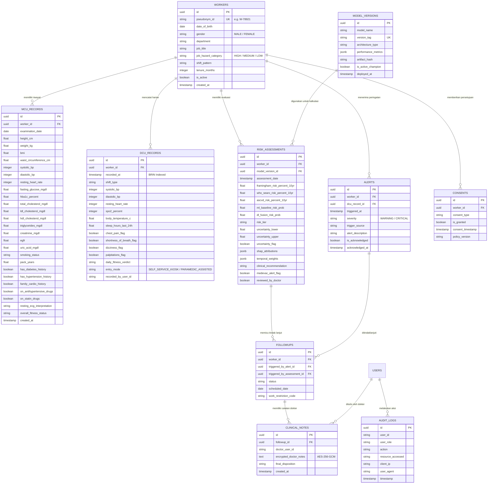

# Entity Relationship Diagram (ERD) — CardioWork

Dokumen ini mendefinisikan skema basis data PostgreSQL yang diterapkan pada CardioWork, yang dirancang khusus untuk memenuhi standar keandalan serverless Vercel (Neon Postgres connection pooling) dan kepatuhan privasi medis (UU PDP No. 27/2022).

---

## 1. Diagram Relasional (Mermaid)

